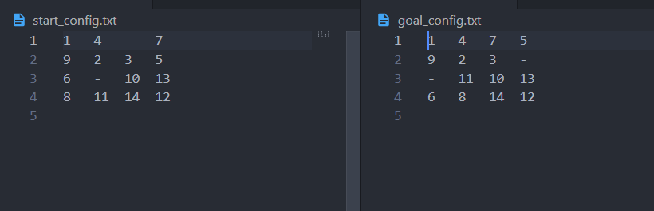
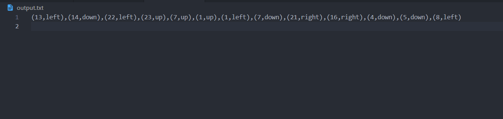
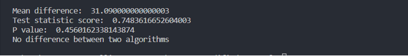

# `N-Puzzle`
**CS3612 - Intelligent Systems**

An N-puzzle involves solving a square board filled with numbered tiles. The board of the basic puzzle has simply one vacant area that may be filled with tiles to change the layout. The rearranged tiles must produce the necessary goal state for the problem to be solved. 

## Whats A* Algorithm
<p align = "center">

</p>

A common puzzle called a puzzle or sliding puzzle is made up of N tiles, where N can be anything from 8 to 24. There are (N+1) rows and (N+1) columns in the problem, for example. A 15-Puzzle has four rows and four columns, an 8-Puzzle has three rows and three columns, and so on. The puzzle has a single vacant spot where the tiles may be placed, and it is completed when a certain target pattern is created, one of which is the following.


## Problem

In this research I concentrated on a problem with two vacant (“-“) areas rather than one. N tiles make up the problem, and there are two vacant spots for the tiles to travel between. The puzzle has Start and Goal configurations, commonly known as states. By rearranging the tiles in the empty spots, the puzzle may be solved, and the Goal configuration achieved. A* algorithm involves here. [1]

### Sample image of start and goal configuration

 

### Sample image of the output file
 


### Run the `command_line_n_puzzle.py` on command 
```
python command_line_n_puzzle.py start_config.txt goal_config.txt 

```
### Randomly generated test cases
The following code was used to create 100 n-puzzle problems at random with puzzle 

```
def random_puzzle_creation(n):
    puzzle = np.full((n, n), '-', dtype=object)
    items = list(range(1, n**2 + 1))
    mixed_items = items[:]
    random.shuffle(mixed_items)
    for i in items[:-2]:
        x = (mixed_items[i-1] - 1)//n
        y = mixed_items[i-1]-1-x*n
        puzzle[x][y] = str(i)
    return puzzle.tolist()
```

## Sample out of the analysis

The output displayed below demonstrates the creation of 100 start and goal pairings as well as their statistical analysis following the application of the two heuristics. misplaced tiles, Manhattan Distance



According to the analysis above, a significant value (p-value) of roughly 0.46 is achieved for the 
specific 100 randomly generated start and goal pairs. A p-value of 0.05 or less would be required 
to reject the null hypothesis at a 95% confidence level. Since there is no significant difference 
between the two implementations employing the two heuristics in this case. The statistical 
analysis uses the **Scipy** and **Numpy** libraries

### Following code part used for analysis 
```
    mean = abs(np.mean(misplaced_steps)-np.mean(manhattan_steps))
    alpha = 0.05
    t_score, p_val = (stats.ttest_rel(misplaced_steps, manhattan_steps))
    print("Mean difference: ", mean)
    print("Test statistic score: ",t_score)
    print("P value: ",p_val)
    if p_val <= alpha:
        print('Difference between two algorithms')
    else:
        print('No difference between two algorithms')

```

***
## Reference
[1] “A-star(A*) in general”

https://algorithmsinsight.wordpress.com/graph-theory-2/a-star-in-general
